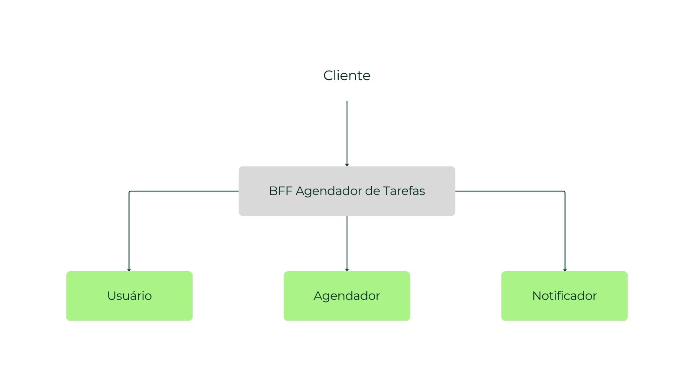

# BFF - Agendador de Tarefas
BFF é uma sigla para Backend For Frontend, o responsável por centralizar o acesso ao sistema de gerenciamento de tarefas, usuários e notificações.

O projeto utiliza uma arquitetura baseada em microsserviços, onde cada serviço possui uma responsabilidade única. O BFF atua como o ponto de entrada da aplicação, recebendo requisições do cliente e realizando a comunicação com os microsserviços.

## Arquitetura
O sistema é composto pelos seguintes sistemas:

- BFF Agendador de Tarefas - ponto de entrada da aplicação e o responsável por fazer a interface com o cliente e a comunicação entre os microsserviços.
- Usuário - gerenciamento e autenticação de usuários.
- Agendador - gerenciamento de tarefas.
- Notificador - processamento e envio de notificações via e-mail.

### Fluxo da aplicação

## Usuario
Microsserviço responsável pelo gerenciamento dos usuários, contando com um **CRUD** completo, endpoints de autenticação e outras funcionalidades relacionadas ao usuário.

### Autenticação 
A autenticação dos usuários é responsabilidade do microsserviço específico de usuário.

A autenticação utiliza **JWT (Json Web Token)** para permitir que os endpoints protegidos recebam requisições autenticadas.

## Agendador
Microsserviço responsável pelo gerenciamento de tarefas, contando com um **CRUD** completo, e outras funcionalidades relacionadas ao gerenciamento e agendamento de tarefas.

## Notificador
Microsserviço responsável por notificar usuários via e-mail quando eles possuem alguma tarefa cadastrada e que está agendada para a próxima hora.

## Tecnologias
- Java
- Spring Boot
- Spring Web
- Spring Security
- Spring Data JPA
- PostgreSQL
- OpenFeign
- Docker
- Gradle
- SonarQube

## Docker
O docker é utilizado no projeto para facilitar a execução e a padronização do ambiente.

O arquivo **docker-compose.yml** é o responsável pela orquestração dos serviços necessários para executar completamente a aplicação.Dentro desse arquivo, foram definidas regras para o download das imagens dos microsserviços e execução das mesmas.

## Qualidade
No quesito qualidade de código, o **SonarQube** foi utilizado como uma ferramenta para analisar e identificar possíveis erros (code smells) e bugs que poderiam atrapalhar a execução da aplicação.

## Autor

- [Arthur Rodrigues](https://www.linkedin.com/in/arthur-rodriguesx/)
